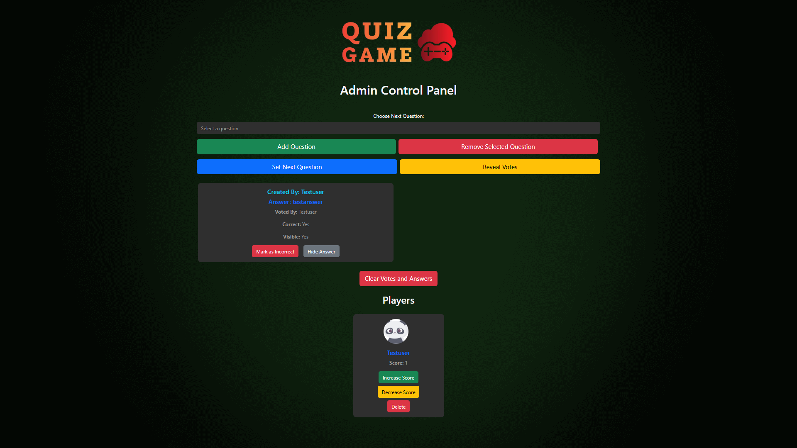

(static/img/logo.webp)
# Quiz Game - Multiplayer Online Game

## Overview

Quiz Game is an interactive multiplayer web application that brings excitement and strategy to online gaming. Players submit answers, vote on responses, and compete to showcase their wit and creativity.

## Key Features

- 🎮 Real-time Multiplayer Gameplay
- 📝 Dynamic Answer Submission
- 🗳️ Interactive Voting System
- 👥 Personalized User Avatars
- 🏆 Competitive Scoring Mechanism
- 🔐 Secure Admin Controls

## Technology Stack

- **Backend**: Python Flask
- **Frontend**: HTML, CSS, JavaScript
- **Real-time Communication**: Socket.IO
- **Styling**: Bootstrap

## Game Mechanics

1. **Player Mode**
   - Login with unique credentials
   - Submit creative answers to questions
   - Vote on other players' responses
   - Earn points based on votes and accuracy

2. **Admin Mode**
   - Manage game questions
   - Control game flow
   - Reveal and calculate points
   - Moderate gameplay

## Screenshots

### Login Screens
| Login Screen | Login with Name |
|--------------|-----------------|
|  |  |

### Game Interface
| Homepage | Admin Screen |
|----------|--------------|
|  |  |

### Game Progression
| After Revealing Answer | After Mark as Correct |
|------------------------|------------------------|
|  |  |

### Final View
| Final Admin View |
|------------------|
|  |

## Prerequisites

- Python 3.8+
- pip

## Installation

1. Clone the repository
   ```bash
   git clone https://github.com/Kingof3O/quiz-game.git
   cd quiz-game
   ```

2. Create virtual environment
   ```bash
   python -m venv venv
   source venv/bin/activate  # Windows: venv\Scripts\activate
   ```

3. Install dependencies
   ```bash
   pip install -r requirements.txt
   ```

4. Configure environment variables
   Create a `.env` file with:
   ```
   SECRET_KEY=your_secret_key
   ADMIN_PASSWORD=your_admin_password
   USER_PASSWORD=your_user_password
   ```

## Running the Application

```bash
python app.py
```

## Security Notes

- Use strong, unique passwords
- Keep `.env` file private
- Do not share credentials

## Contributing

1. Fork the repository
2. Create a feature branch
3. Commit changes
4. Push to branch
5. Open pull request

## License

MIT License - see [LICENSE](LICENSE) file

## Future Enhancements

- [ ] Add more question types
- [ ] Implement advanced user authentication
- [ ] Create global leaderboard
- [ ] Support multiple languages
